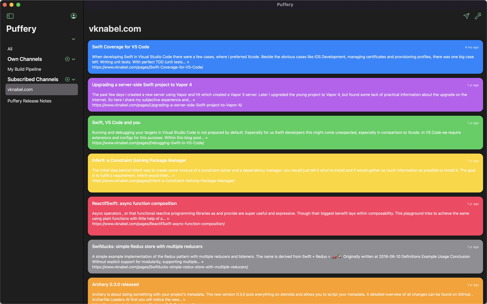
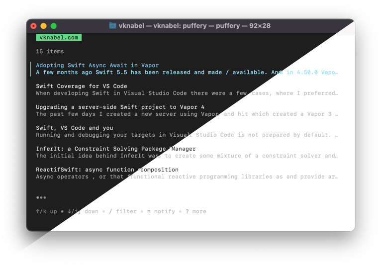

Two years ago, I created [Puffery for iOS](https://apps.apple.com/de/app/puffery/id1508776889), which allows sending push notifications to your iOS devices.

You can follow other's channels and directly receive updates. There is no algorithm that decides wether you should receive notifications or not.

From the beginning scripting is part of puffery's DNA: you were able to send messages with Siri Shortcuts and a simple `curl` command.

> If you want to take a deeper look, feel free to check out the [GitHub repository](https://github.com/vknabel/puffery) including the Swift Server written in Vapor, and the iOS app built with SwiftUI in a single mono-repo.

## Puffery for macOS

If you do no share your channels, sending and receiving messages and thus push notifications from the same iOS device is kind of useless in the long run.

Some of your most productive time of the day, you are probably sitting in front of your Mac. And a macOS app better integrates into your daily workflow.

Of course, you can use your Shortcuts from your iOS device. But what's special on macOS is the ability to pin specific workflows to the dock or the status bar. Even adding workflows to your share menus is possible!

No need to open Puffery directly if you don't want to. No distractions.

If you are a user of macOS widgets, you are covered, too! They work exactly the same way as on iOS.

## Puffery for the command line

With the next announcement, we are slowly moving outside of the Apple ecosystem. Puffery is now available as a command line tool. Currently it has a limited scope and has not yet received feature parity with the iOS or macOS apps, but it does not only support macOS, but also Linux _and_ Windows.

It provides a tui / text based interface to scroll through lists of channels and messages. You can also send messages to a previously selected channel.

You can even signup or login with your existing account.

To give it a try, have a look on the [puffery installation instructions](https://github.com/vknabel/go-puffery#installation).

It has been built in Go and [Charm](https://charm.sh/)'s [Bubble Tea library](https://github.com/charmbracelet/bubbletea). As all of Puffery, it is open source and licensed under the [MIT license](https://github.com/vknabel/go-puffery/blob/main/LICENSE).
